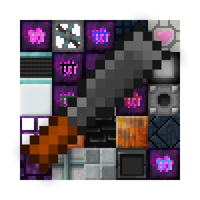

# ReChiseled Extras

ReChiseled Extras is a forge 1.20.1 addon mod for ReChiseled.

It adds the custom blocks from the Chisel 1.12 mod that are not part of ReChiseled:

* factory blocks
* laboratory blocks
* futura
* voidstone
* valentines
* tyrian

If you are looking for antiblocks, there is already [AntiBLocksReChiseled](https://github.com/manmaed/AntiBlocksReChiseled) that adds them.

ReChiseled is built using a connected texture rendering library called Fusion. Fusion is slightly different from Chisel's CTM and this has led to a few differences between ReChiseled-extras and the original Chisel blocks:

* Laboratory `white panel` and `dotted panel` variants have an additional "wall" style connected texture.
* `primal voidstone` animates with a 2x2 pattern in chisel, but fusion only supports a 1x1 animation layer.
* The "massive" fan, hexagonal plating, and sloppy plating all use a 3x3 logical tesselation that fusion doesn't support.

Additionally, most blocks that have connected textures have non-connected variants, like the blocks in ReChiseled itself.

## License

The Code in the Chisel mod is licesned GPLv2, but no code from that mod is reused in ReChiseled Extras. Except where specified, code, build scripts, etc are covered by the MIT
Licence in the LICENCE file.

A majority of the texture data comes from the Chisel mod. This _appears_ to also be GPLv2, as it's not covered by any of the CC cutouts in their README. Therefore, all of the
files in the following directories are distributed under GPLv2 as they are either taken from or derived from textures in Chisel:

  * `src/main/resources/assets/rechiseled_extras/textures`

Many of these images are converted from 1.12's CTM mod to Fusion, so they are derived works that retain the GPL licensing.

The rechiseled icon in `assets/` is reused with permission. For the purpose of derivations it should be considered as
available here under its original license.
